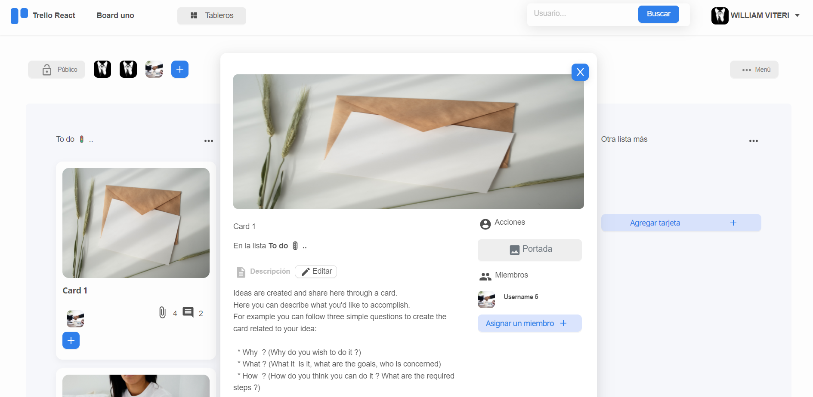

<!-- Please update value in the {}  -->

<h1 style="text-align: center">Thullo</h1>

<div style="text-align: center">
   Solution for a challenge from  <a href="http://devchallenges.io" target="_blank">Devchallenges.io</a>.
</div>

<div style="text-align: center">
  <h3>
    <a href="https://thullo-wavp.vercel.app">
      Solution
    </a>
    <span> | </span>
    <a href="https://devchallenges.io/challenges/wP0LbGgEeKhpFHUpPpDh">
      Challenge
    </a>
  </h3>
</div>

<!-- TABLE OF CONTENTS -->

## Table of Contents

- [Overview](#overview)
  - [Built With](#built-with)
- [Features](#features)
- [How to use](#how-to-use)
- [Contact](#contact)

<!-- OVERVIEW -->

## Overview



### Built With

<!-- This section should list any major frameworks that you built your project using. Here are a few examples.-->

- [React](https://reactjs.org/)
- [Vue.js](https://vuejs.org/)
- [Ant Design](https://ant.design/)
- [i18next](https://www.i18next.com/)
- [Redux](https://es.redux.js.org/)
- [Firabase](https://firebase.google.com/)
- [MongoDB](https://www.mongodb.com/)
- [Node.js](https://nodejs.org/)

## Features

<!-- List the features of your application or follow the template. Don't share the figma file here :) -->

This application/site was created as a submission to a [DevChallenges](https://devchallenges.io/challenges) challenge. The [challenge](https://devchallenges.io/challenges/wP0LbGgEeKhpFHUpPpDh) was to build an application to complete the given user stories.

## How To Use

<!-- Example: -->

To clone and run this application, you'll need [Git](https://git-scm.com) and [Node.js](https://nodejs.org/en/download/) (which comes with [npm](http://npmjs.com)) installed on your computer. From your command line:

```bash
# App
# Clone this repository
$ git clone https://github.com/william-vp/trello-clone-react/trello

# Install dependencies
$ npm install

# Run the app
$ npm start# Clone this repository

# Server
# Run the app
$ git clone https://github.com/william-vp/trello-clone-react/server

# Install dependencies
$ npm install

# Run the app
$ npm start
```
## Contact

- GitHub [@william-vp](https://github.com/william-vp)
